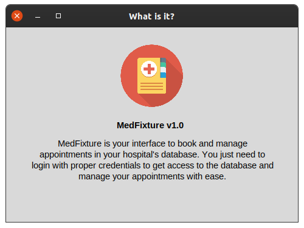
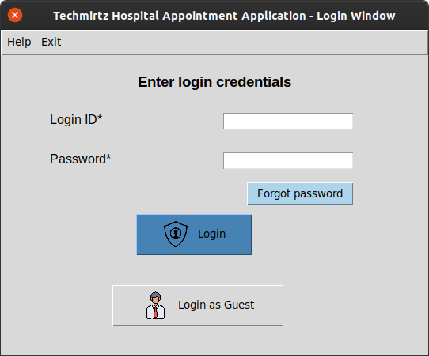
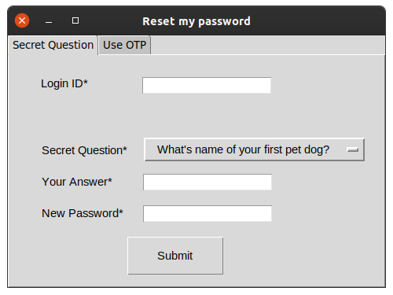
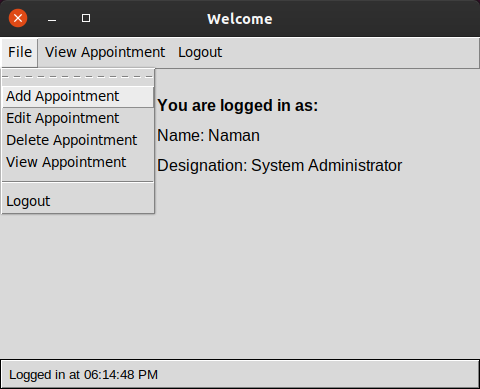
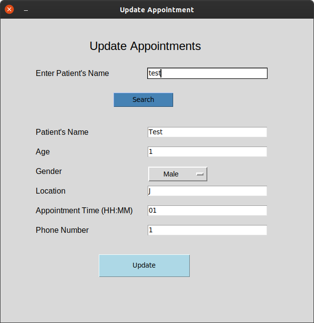
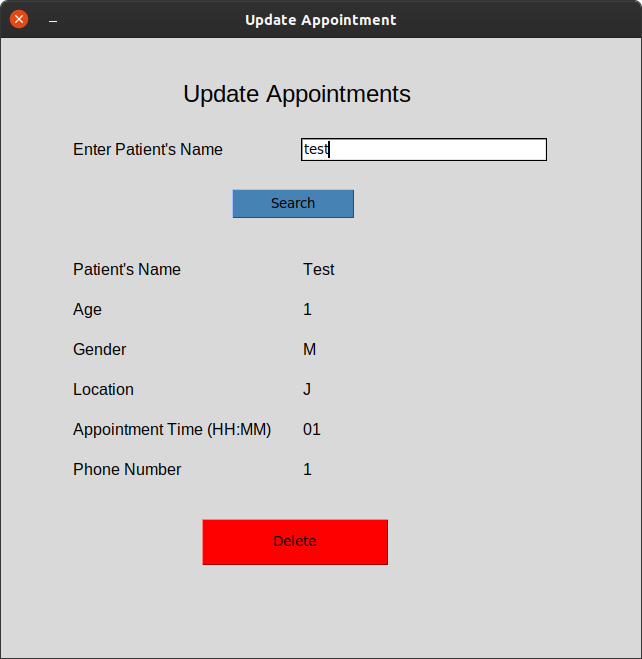
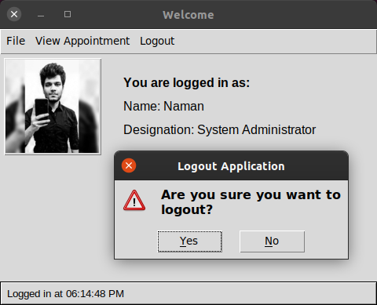

<p align="center">
  
  
</p>

<p align="center">
  
  
  
  
  
  
</p>
                                                                                     
<p align="center">
  
  
</p>


<!-- PROJECT LOGO -->
<br />
<p align="center">
  <a href="https://github.com/chauhannaman98/MedFixture">
    
  </a>

  <h3 align="center">MedFixture</h3>

  <p align="center">
    A GUI application to make and manage hospital appointments in a database!
    <br />
    <a href="https://github.com/chauhannaman98/MedFixture/blob/master/README.md"><strong>Explore the docs »</strong></a>
    <br />
    <br />
    <a href="https://github.com/chauhannaman98/MedFixture">View Demo</a>
    ·
    <a href="https://github.com/chauhannaman98/MedFixture/issues">Report Bug</a>
    ·
    <a href="https://github.com/chauhannaman98/MedFixture/issues">Request Feature</a>
    ·
  <a href="https://github.com/chauhannaman98/Medixture/pulls">Make Pull Request</a>
  </p>
</p>


<!-- TABLE OF CONTENTS -->
## Table of Contents

* [About the Project](#about-the-project)
  * [Features](#features)
  * [Built Using](#built-using)
* [Getting Started](#getting-started)
  * [Prerequisites](#prerequisites)
  * [Installation](#installation)
* [Changelog]()
* [Contributing](#contributing)
* [License](#license)
* [Contact](#contact)
* [Acknowledgements](#acknowledgements)

<!-- ABOUT THE PROJECT -->
## About the Project

<p align="center">
  <a href="https://github.com/chauhannaman98/MedFixture">
    
  </a>
</p>

MedFixture is an application to book and manage the appointments of a hospital or clinic. The application itself doesn't save any data, that is, the login credentials, authentication data and patients' data is not hard programmed in the python script. The data which is handled by the application is actualy stored in an SQLite database. The appication itself can be used by several people and institutions. We just need to connect it the corresponding database.

### Features
* Uses a master login window to access the database and make data transactions. It even has a _Login as Guest_ feature to login for only viewing the data and not editing the database.
<p align="center">
  <a href="https://github.com/chauhannaman98/MedFixture">
    
  </a>
</p>

* If the user forgets the password, the application also has a feature to reset the password using the saved secret questions. The option to reset password usign OTP/reset link will be pushed in the upcoming versions hopefully.
<p align="center">
  <a href="https://github.com/chauhannaman98/MedFixture">
    
  </a>
</p>

* If logged in using an user, authenticated by the credentials from the database, a new toplevel window opens and show the profile details. It also gives options to add, edit or delete the appointments.
<p align="center">
  <a href="https://github.com/chauhannaman98/MedFixture">
    
  </a>
</p>

* On clicking on _Add Appointment,_ a new window to add new appointment is opened which saves new data to connected database.
<p align="center">
  <a href="https://github.com/chauhannaman98/MedFixture">
    
  </a>
</p>

* On clicking on _Edit Appointment,_ a new window to edit existing appointment which updates data to connected database.
<p align="center">
  <a href="https://github.com/chauhannaman98/MedFixture">
    
  </a>
</p>

* On clicking on _Delete Appointment,_ a new window to delete any existing appointment which is saved in the connected database.
<p align="center">
  <a href="https://github.com/chauhannaman98/MedFixture">
    
  </a>
</p>

* On completing your work, you can simply logout your session and re-login again.
<p align="center">
  <a href="https://github.com/chauhannaman98/MedFixture">
    
  </a>
</p>

### Built using
* Software
  * [Python 3.7](https://www.python.org/)
  * [tkinter](https://docs.python.org/3/library/tkinter.html) for Python 3.x
  * [Visual Studio Code](https://code.visualstudio.com/)
  * [SQLite Browser](http://sqlitebrowser.org/)
* Hardware
  * Desktop/laptop
  * OS: Windows 10/Linux (Recommended Ubuntu 18.0+)
  
## Getting Started
To use the this application on your system, you can simply clone this repository or download the .zip file. But, to run the application with all it's features, you must make proper setup and installation of libraries and prerequisites.

### Prerequisites
* Make sure that you have Python v3.x installed on your machine. Otherwise, you can just use this command to install python3 on Ubuntu :
```sh
sudo apt install python3
```
Otherwise, just go [here](https://www.python.org/) and download the python for your system.

* To install tkinter module for python 3, use the following command:
```sh
sudo apt install python3-tk
```

* Application uses SQLite3. Thus to install the module for python3, type the command:
```sh
sudo apt install sqlite3
```

* The `master.py` is also using Pillow which is a Python imaging library. To install the relevant module, use the following command:
```sh
sudo apt install python3-pil
```

### Installation

1. Clone the repository or download the .zip from [here](https://github.com/chauhannaman98/MedFixture/archive/master.zip).
```sh
git clone https://github.com/chauhannaman98/MedFixture.git
```

2. Make sure you have installed all the [prerequisites](#prerequisites) and required [tools](#built-using) and modules.


<!-- CONTRIBUTING -->
## Contributing

Contributions are what make the open source community such an amazing place to be learn, inspire, and create. Any contributions you make are **greatly appreciated**.

1. :fork_and_knife: Fork the Project
2. :sparkles: Create your Feature Branch (`git checkout -b feature/AmazingFeature`)
3. :white_check_mark: Commit your Changes (`git commit -m 'Add some AmazingFeature'`)
4. :seedling: Push to the Branch (`git push origin feature/AmazingFeature`)
5. :arrow_heading_up: Open a Pull Request


<!-- LICENSE -->
## License

Distributed under the GNU General Public License v3.0 License. See [LICENSE](https://github.com/chauhannaman98/MedFixture/blob/master/LICENSE) for more information.


<!-- CONTACT -->
## Contact

Made with :heart: by Naman Chauhan - [@techmirtz](https://twitter.com/techmirtz) - chauhannaman98gmail.com

Project Link: [https://github.com/chauhannaman98/MedFixture](https://github.com/chauhannaman98/Medfixture)


<!-- ACKNOWLEDGEMENTS -->
## Acknowledgements
* [GitHub Emoji Cheat Sheet](https://www.webpagefx.com/tools/emoji-cheat-sheet)
* [Img Shields](https://shields.io)
* [GNU General Public License v3.0](https://choosealicense.com/licenses/gpl-3.0/)
* [Hospital-Management-System on Github by onthir](https://github.com/onthir/Hospital-Management-System)
